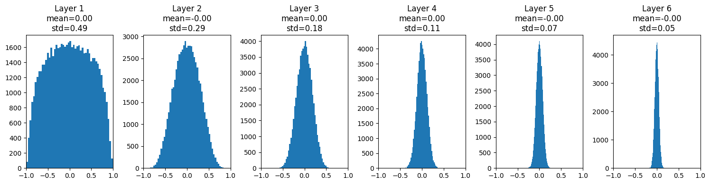
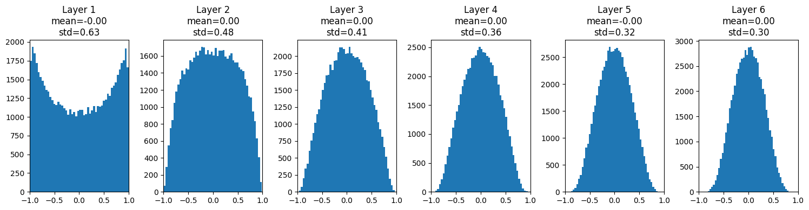
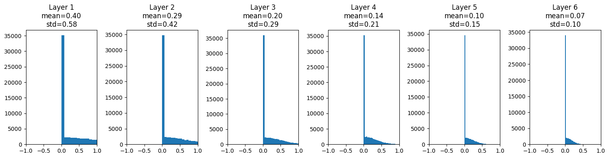
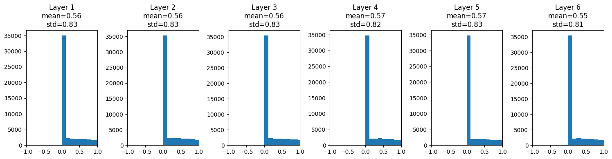

神经网络的权重初始化会直接影响前向传播中的激活分布，以及反向传播时梯度能否稳定流动。本文从一个线性层出发，逐步比较零初始化、小随机数、Xavier 初始化和 Kaiming 初始化。

> 本文整理自 [`hengproject/ML_recall`](https://github.com/hengproject/ML_recall) 中的 [`basics/weight_initialization.ipynb`](https://github.com/hengproject/ML_recall/blob/main/basics/weight_initialization.ipynb)。课程内容参考 USC CSCI 566: Deep Learning and Its Applications。

## 从零初始化开始

以一个线性层为例。使用增广记号，将偏置合并到输入向量中：

$$
\underline{x} = [x_0, x_1, \ldots, x_n, b],
\qquad
Y = \underline{w}^{T}\underline{x}.
$$

如果所有权重都初始化为零，那么无论输入如何变化，线性层的输出都会是零：

```python
import numpy as np
import matplotlib.pyplot as plt

x = np.ones(100)
w = np.zeros(100)
y = w.T @ x
print(y)  # 0.0
```

更重要的是，对具有多个同构神经元的网络而言，相同的初始权重会产生相同的输出和梯度，神经元无法学习出不同特征。因此，需要用非零随机值打破对称性。

## 小随机数初始化

一种直观方法是从方差很小的高斯分布中采样权重：

$$
\underline{w} \sim \mathcal{N}(\mu, \sigma^2).
$$

```python
np.random.seed(2025)
w = 0.01 * np.random.randn(100)
y = w.T @ x
```

单层网络中，这似乎没有问题；但在深层网络中，每一层都会继续缩小信号。下面构造一个六层、使用 `tanh` 激活函数的网络：

$$
h_0 = x,
\qquad
h_i = \tanh(h_{i-1}W_i^T).
$$

```python
dims = [4096] * 7
activations = []
x = np.random.randn(16, dims[0])

for fan_in, fan_out in zip(dims[:-1], dims[1:]):
    w = 0.01 * np.random.randn(fan_in, fan_out)
    x = np.tanh(x @ w.T)
    activations.append(x)
```



越靠后的层，激活值越集中在零附近。信号和梯度逐层衰减，网络会变得难以训练。

## Xavier 初始化

Xavier 初始化的目标是让输入与输出的方差尽可能保持一致。对 `fan_in` 个输入，常用的正态分布形式为：

$$
W \sim \mathcal{N}\left(0, \frac{1}{n_{in}}\right).
$$

假设 $W_{ji}$ 与 $x_i$ 相互独立、均值为零，且

$$
W_{ji} \sim \mathcal{N}\left(0, \frac{1}{n_{in}}\right),
\qquad
\operatorname{Var}(x_i) = \sigma^2.
$$

对线性变换 $z_j = \sum_i W_{ji}x_i + b_j$，有：

$$
\begin{aligned}
\operatorname{Var}(z_j)
&= \sum_{i=1}^{n_{in}} \operatorname{Var}(W_{ji}x_i) \\
&= \sum_{i=1}^{n_{in}} \operatorname{Var}(W_{ji})\operatorname{Var}(x_i) \\
&= n_{in} \cdot \frac{1}{n_{in}} \cdot \sigma^2 \\
&= \sigma^2.
\end{aligned}
$$

`tanh` 在零附近近似线性，因此这种初始化能够在一定程度上让各层激活保持相近的方差：

```python
dims = [4096] * 7
activations = []
x = np.random.randn(16, dims[0])

for fan_in, fan_out in zip(dims[:-1], dims[1:]):
    w = np.random.randn(fan_in, fan_out) / np.sqrt(fan_in)
    x = np.tanh(x @ w.T)
    activations.append(x)
```



## Xavier 与 ReLU

将相同的 Xavier 初始化直接用于 ReLU，激活分布仍然会随网络加深而收缩：

```python
for fan_in, fan_out in zip(dims[:-1], dims[1:]):
    w = np.random.randn(fan_in, fan_out) / np.sqrt(fan_in)
    x = np.maximum(0, x @ w.T)
```



ReLU 会把负值截断为零。在输入关于零对称的近似条件下，可将其视为使二阶矩大约减半。为保持尺度，需要令：

$$
\begin{aligned}
\operatorname{Var}(z_j)
&= n_{in}\sigma_w^2\sigma_x^2, \\
\operatorname{Var}(\operatorname{ReLU}(z_j))
&\approx \frac{1}{2}n_{in}\sigma_w^2\sigma_x^2.
\end{aligned}
$$

要求输出尺度与输入一致，可得：

$$
\frac{1}{2}n_{in}\sigma_w^2\sigma_x^2 = \sigma_x^2
\quad\Longrightarrow\quad
\sigma_w^2 = \frac{2}{n_{in}}.
$$

## Kaiming 初始化

因此，对 ReLU 网络可按下面的标准差初始化权重：

$$
\sigma_w = \sqrt{\frac{2}{n_{in}}}.
$$

```python
dims = [4096] * 7
activations = []
x = np.random.randn(16, dims[0])

for fan_in, fan_out in zip(dims[:-1], dims[1:]):
    w = np.random.randn(fan_in, fan_out) * np.sqrt(2 / fan_in)
    x = np.maximum(0, x @ w.T)
    activations.append(x)
```



## 小结

| 初始化方法 | 典型尺度                                   | 更适合的激活函数                 |
| ---------- | ------------------------------------------ | -------------------------------- |
| 小随机数   | $0.01 \cdot \mathcal{N}(0, 1)$             | 浅层网络或实验基线               |
| Xavier     | $\operatorname{Var}(W) \approx 1 / n_{in}$ | `tanh`、`sigmoid` 等近似对称激活 |
| Kaiming    | $\operatorname{Var}(W) \approx 2 / n_{in}$ | ReLU 及其变体                    |

初始化方法的核心不是记住常数，而是控制信号在网络深度方向上的尺度。实际使用时，还应结合激活函数、残差连接、归一化层和框架提供的初始化 API 共同考虑。
