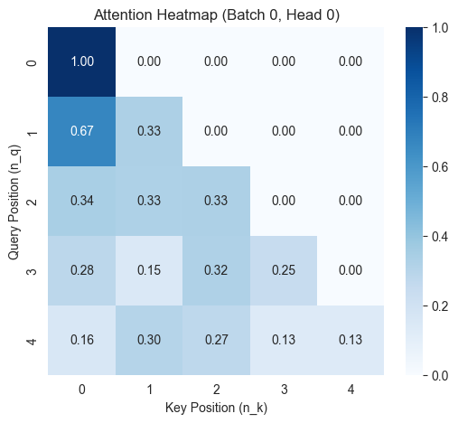
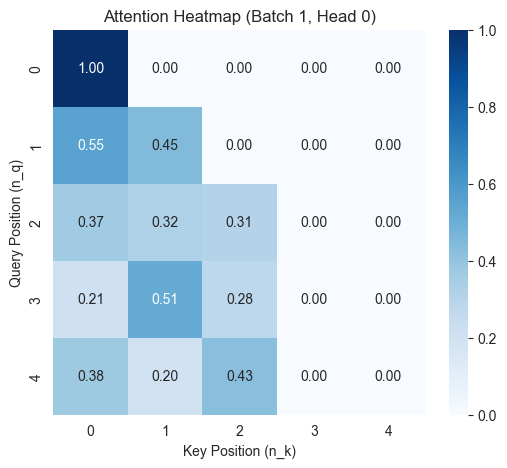

import InfoDrawer from '@/components/custom/InfoDrawer.astro'

注意力机制的共同目标是：根据当前查询为一组候选信息分配权重，再将它们聚合为上下文表示。本文从机器翻译中的 Additive Attention 出发，逐步过渡到 Transformer 使用的 Multi-Head Attention。

> 本文整理自 [`hengproject/ML_recall`](https://github.com/hengproject/ML_recall) 中的 [`basics/attention.ipynb`](https://github.com/hengproject/ML_recall/blob/master/basics/attention.ipynb)。参考了 [hwcoder 的手写笔记](https://hwcoder.top/Manual-Coding-1)及[《Recurrent Models of Visual Attention》精读](https://zhuanlan.zhihu.com/p/555778029)。

## Additive Attention

Bahdanau 等人在 2014 年的论文 [_Neural Machine Translation by Jointly Learning to Align and Translate_](https://arxiv.org/abs/1409.0473) 中，将注意力机制用于神经机器翻译。生成每个目标 token 时，解码器会为编码器的全部隐藏状态分配权重，并计算上下文向量。

设解码器上一步的隐藏状态(hidden_state)为 $s_{i-1}$，编码器在第 $j$ 个位置的隐藏状态(hidden_state)为 $h_j$。

### 1. 计算匹配分数

$$
e_{ij} = v_a^T\tanh(W_a s_{i-1} + U_a h_j).
$$

$W_a$、$U_a$ 和 $v_a$ 都是可训练参数。这个评分函数可视为一个带 `tanh` 的小型前馈网络，用于估计当前解码状态与每个编码器状态的匹配程度。

### 2. 归一化注意力权重

<InfoDrawer title='注意力分数与权重'>
  $e_{ij}$ 是未经归一化的注意力分数，$\alpha_{ij}$ 是经过 softmax 后得到的注意力权重，满足
  $\sum_j\alpha_{ij}=1$，并实际用于编码器状态的加权聚合。
</InfoDrawer>

$$
\alpha_{ij}
= \frac{\exp(e_{ij})}{\sum_{k=1}^{T_x}\exp(e_{ik})},
\qquad
\sum_{j=1}^{T_x}\alpha_{ij}=1.
$$

实现 softmax 时减去最大分数，可以避免指数运算溢出。

### 3. 聚合上下文

$$
c_i = \sum_{j=1}^{T_x}\alpha_{ij}h_j.
$$

$c_i$ 是编码器状态的加权和，表示生成第 $i$ 个目标 token 时需要的源序列信息。

### NumPy 实现

```python
import numpy as np

def additive_attention(s_prev, h, W_a, U_a, v_a):
    """
    s_prev: (hidden_size,)
    h:      (source_length, hidden_size)
    W_a:    (attention_dim, hidden_size)
    U_a:    (attention_dim, hidden_size)
    v_a:    (attention_dim,)
    """
    source_length = h.shape[0]
    s_expanded = np.broadcast_to(s_prev, (source_length, s_prev.size))

    energy = np.tanh(s_expanded @ W_a.T + h @ U_a.T) @ v_a
    weights = np.exp(energy - np.max(energy))
    weights /= np.sum(weights)
    context = weights @ h
    return context, weights
```

### 支持 batch 的 PyTorch 实现

```python
import torch
import torch.nn as nn
import torch.nn.functional as F

class AdditiveAttention(nn.Module):
    def __init__(self, hidden_size, attention_dim):
        super().__init__()
        self.W_a = nn.Linear(hidden_size, attention_dim, bias=False)
        self.U_a = nn.Linear(hidden_size, attention_dim, bias=False)
        self.v_a = nn.Parameter(torch.randn(attention_dim))

    def forward(self, s_prev, h):
        # s_prev: (batch, hidden_size)
        # h:      (batch, source_length, hidden_size)
        source_length = h.size(1)
        s_expanded = s_prev.unsqueeze(1).expand(-1, source_length, -1)

        energy = torch.tanh(self.W_a(s_expanded) + self.U_a(h))
        scores = torch.matmul(energy, self.v_a)
        weights = F.softmax(scores, dim=-1)
        context = torch.bmm(weights.unsqueeze(1), h).squeeze(1)
        return context, weights
```

## Scaled Dot-Product Attention

Transformer 在 2017 年的 [_Attention Is All You Need_](https://arxiv.org/abs/1706.03762) 中使用 Query、Key 和 Value 表示注意力计算。对输入序列矩阵 $X$：

$$
Q = XW_Q,
\qquad
K = XW_K,
\qquad
V = XW_V.
$$

Query 和 Key 决定“关注哪里”，Value 提供被聚合的内容。单个注意力头的计算为：

$$
\operatorname{Attention}(Q,K,V)
= \operatorname{softmax}\left(\frac{QK^T}{\sqrt{d_k}}\right)V.
$$

> **记号说明：** $d_k$ 是每个 Query 和 Key 向量的维度，也就是点积中相加项的数量。从这里开始，后文中的 $d_x$ 均表示向量 $x$ 的维度。

### 为什么要缩放点积

假设 $q_i$ 与 $k_i$ 独立、均值为零且方差为一，则点积的期望与方差为：

$$
\begin{aligned}
\mathbb{E}[q\cdot k] &= 0, \\
\operatorname{Var}(q\cdot k)
&= \sum_{i=1}^{d_k}\operatorname{Var}(q_i k_i)
= d_k.
\end{aligned}
$$

因此点积的标准差会随维度按 $\sqrt{d_k}$ 增长。缩放后，分数的数值范围更稳定，可降低 softmax 过早饱和、梯度过小的风险。

## Multi-Head Attention

多头注意力将 $d_{model}$ 维表示拆成 $h$ 个头。常见配置是：

$$
d_k = d_v = \frac{d_{model}}{h}.
$$

每个头分别计算注意力，再拼接并投影回模型维度：

$$
\begin{aligned}
\operatorname{head}_i
&= \operatorname{Attention}(Q_i,K_i,V_i), \\
\operatorname{MultiHead}(Q,K,V)
&= \operatorname{Concat}(\operatorname{head}_1,\ldots,\operatorname{head}_h)W_O.
\end{aligned}
$$

对 self-attention，主要张量形状如下：

| 张量             | 形状              |
| ---------------- | ----------------- |
| 输入 $X$         | $(B,n,d_{model})$ |
| 分头后的 $Q,K,V$ | $(B,h,n,d_k)$     |
| 注意力分数与权重 | $(B,h,n,n)$       |
| 各头的上下文     | $(B,h,n,d_v)$     |
| 最终输出         | $(B,n,d_{model})$ |

## Mask

注意力分数在 softmax 之前加入 mask。被遮蔽位置设为负无穷，softmax 后其权重为零。

### Padding mask

Padding mask 阻止模型关注补齐 token。若 mask 形状为 $(B,n)$，扩展为 $(B,1,1,n)$ 后即可广播到所有注意力头和查询位置：

```python
mask = padding_mask[:, None, None, :]
scores = scores.masked_fill(mask.bool(), float("-inf"))
```

### Causal mask

自回归解码要求第 $t$ 个位置只能看到不晚于自己的 token。上三角位置需要被遮蔽：

```text
[[0, -inf, -inf],
 [0,    0, -inf],
 [0,    0,    0]]
```

```python
causal = torch.triu(
    torch.ones(seq_len, seq_len, device=x.device, dtype=torch.bool),
    diagonal=1,
)
scores = scores.masked_fill(causal[None, None, :, :], float("-inf"))
```

## 完整 PyTorch 实现

```python
import math
import torch
import torch.nn as nn
import torch.nn.functional as F

class MultiHeadAttention(nn.Module):
    def __init__(self, d_model, num_heads):
        super().__init__()
        if d_model % num_heads != 0:
            raise ValueError("d_model must be divisible by num_heads")

        self.d_model = d_model
        self.num_heads = num_heads
        self.d_k = d_model // num_heads
        self.W_q = nn.Linear(d_model, d_model)
        self.W_k = nn.Linear(d_model, d_model)
        self.W_v = nn.Linear(d_model, d_model)
        self.W_o = nn.Linear(d_model, d_model)

    def forward(
        self,
        query,
        key=None,
        value=None,
        padding_mask=None,
        causal=False,
    ):
        key = query if key is None else key
        value = key if value is None else value

        batch_size, query_len, _ = query.shape
        key_len = key.size(1)
        if value.size(1) != key_len:
            raise ValueError("key and value must have the same sequence length")
        if causal and query_len != key_len:
            raise ValueError("causal attention requires equal query and key lengths")

        def split_heads(projection, seq_len):
            return projection.view(
                batch_size, seq_len, self.num_heads, self.d_k
            ).transpose(1, 2)

        Q = split_heads(self.W_q(query), query_len)
        K = split_heads(self.W_k(key), key_len)
        V = split_heads(self.W_v(value), key_len)
        scores = Q @ K.transpose(-2, -1) / math.sqrt(self.d_k)

        if padding_mask is not None:
            scores = scores.masked_fill(
                padding_mask[:, None, None, :].bool(), float("-inf")
            )

        if causal:
            causal_mask = torch.triu(
                torch.ones(
                    query_len,
                    key_len,
                    device=query.device,
                    dtype=torch.bool,
                ),
                diagonal=1,
            )
            scores = scores.masked_fill(
                causal_mask[None, None, :, :], float("-inf")
            )

        weights = F.softmax(scores, dim=-1)
        context = weights @ V
        context = context.transpose(1, 2).contiguous().view(
            batch_size, query_len, self.d_model
        )
        return self.W_o(context), weights
```

下面两张热力图来自原 notebook。第一张展示 causal mask 形成的下三角注意力，第二张还叠加了 padding mask，使后两个 Key 位置不可见。





## 小结

Additive Attention 与 Scaled Dot-Product Attention 使用不同的匹配函数，但都遵循“评分、归一化、聚合”三个步骤。Multi-Head Attention 进一步让模型在多个表示子空间中并行学习关系，而 mask 则把序列结构和有效长度约束注入注意力计算。
